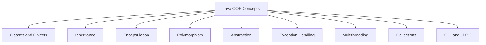
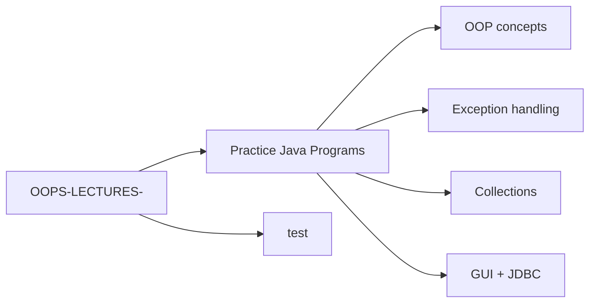

# OOPS Lectures

This repository contains Java programs and practice exercises covering core Object-Oriented Programming (OOP) concepts, exceptions, multithreading, collections, GUI programming, and JDBC.

## Contents

The project includes Java programs such as:

- `ESE.java`
- `FFE.java`
- `Marks.java`
- `MME.java`
- `MULTI.java`
- `MULTI2.java`
- `NAE.java`
- `NPE.java`
- `palindrome.java`
- `throwDemo.java`
- `WeakPasswordException.java`
- `week3.java`
- `wpe.java`
- `test/exception.java`

## Learning Areas

- OOP fundamentals
- Encapsulation, inheritance, polymorphism, abstraction
- Exception handling
- Multithreading
- Collections framework
- File handling and streams
- GUI programming with Swing
- JDBC and database connectivity

## Run Java Programs

From the repository root, compile a Java file:

```bash
javac FileName.java
```

Then run it:

```bash
java FileName
```

## Project Diagram



## Repository Structure



## Notes

This repository is intended for academic learning and Java practice. The programs are organized by topic and can be compiled and executed individually.
