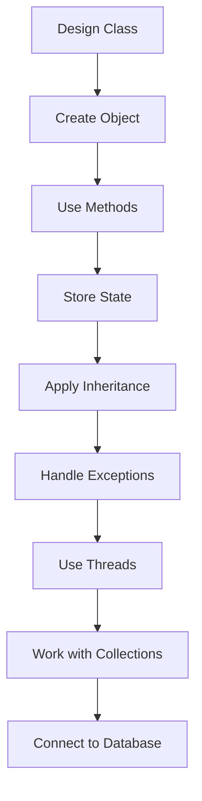
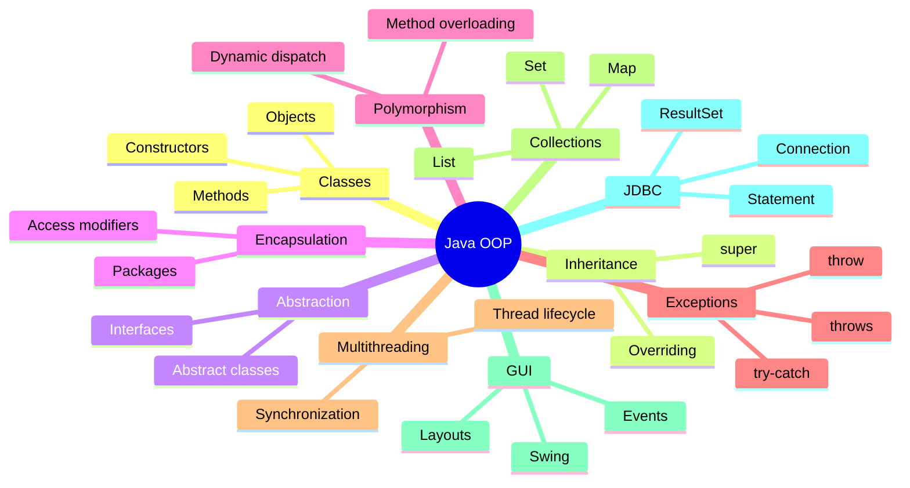
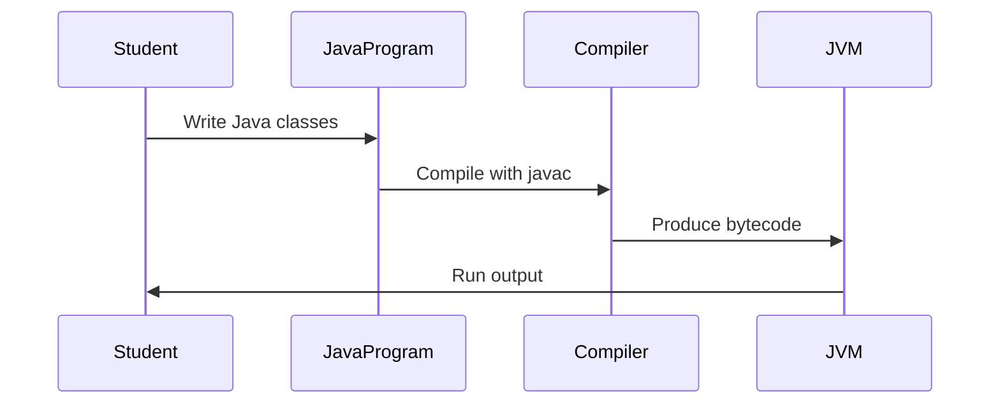

# Diagrams

## Java OOP Lifecycle

```mermaid
flowchart TD
    A[Design Class] --> B[Create Object]
    B --> C[Use Methods]
    C --> D[Store State]
    D --> E[Apply Inheritance]
    E --> F[Handle Exceptions]
    F --> G[Use Threads]
    G --> H[Work with Collections]
    H --> I[Connect to Database]
```

## Core Java Concepts Map

```mermaid
mindmap
  root((Java OOP))
    Classes
      Objects
      Methods
      Constructors
    Inheritance
      super
      Overriding
    Abstraction
      Abstract classes
      Interfaces
    Encapsulation
      Access modifiers
      Packages
    Polymorphism
      Method overloading
      Dynamic dispatch
    Exceptions
      try-catch
      throw
      throws
    Multithreading
      Thread lifecycle
      Synchronization
    Collections
      List
      Set
      Map
    GUI
      Swing
      Layouts
      Events
    JDBC
      Connection
      Statement
      ResultSet
```

## Practice Flow

```mermaid
sequenceDiagram
    participant Student
    participant JavaProgram
    participant Compiler
    participant JVM

    Student->>JavaProgram: Write Java classes
    JavaProgram->>Compiler: Compile with javac
    Compiler->>JVM: Produce bytecode
    JVM->>Student: Run output
```
